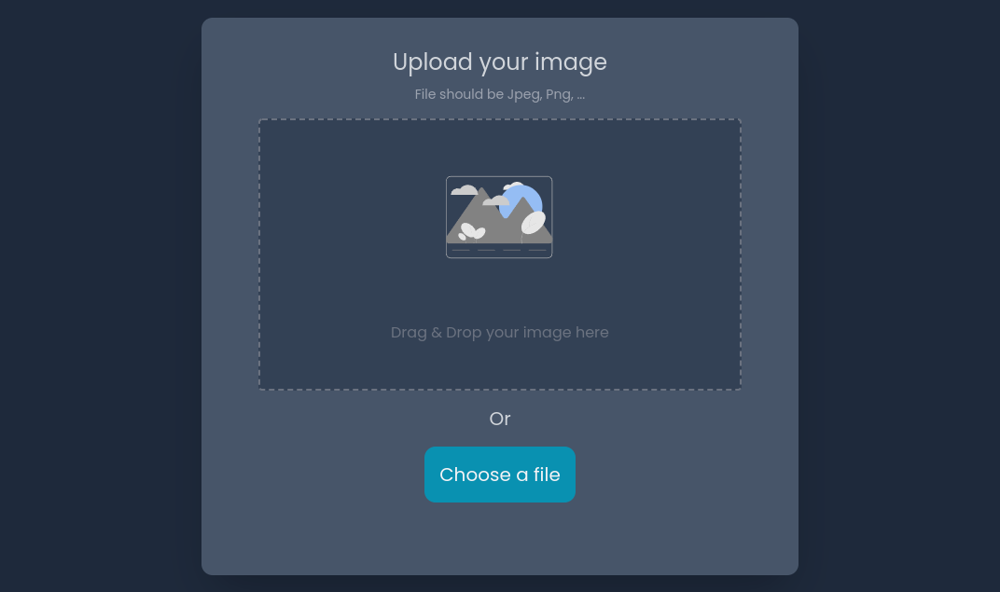

<!-- Please update value in the {}  -->

<h1 align="center">Image Uploader</h1>

<div align="center">
   Solution for a challenge from  <a href="http://devchallenges.io" target="_blank">Devchallenges.io</a>.
</div>

<div align="center">
  <h3>
    <a href="https://image-uploader-vert-rho.vercel.app/">
      Demo
    </a>
    <span> | </span>
    <a href="https://github.com/Nikl4auss/image-uploader">
      Solution
    </a>
    <span> | </span>
    <a href="https://devchallenges.io/challenges/O2iGT9yBd6xZBrOcVirx">
      Challenge
    </a>
  </h3>
</div>

<!-- TABLE OF CONTENTS -->

## Table of Contents

- [Overview](#overview)
- [Built With](#built-with)
- [Features](#features)
- [How to use](#how-to-use)
- [Contact](#contact)

<!-- OVERVIEW -->

## Overview


<br />

This project is a solution to the Image Uploader challenge from devChallenges.io.
You can upload any image as long its type is jpge, png or svg. Images are uploaded to Cloudinary.
Overall I would say that this project was Ok, I didn't fell that my skills where challenged most of the time, although I did need to learn
about Drag & Drop events and how to handle them.

### Built With

<!-- This section should list any major frameworks that you built your project using. Here are a few examples.-->

- [React](https://reactjs.org/)
- [Tailwind](https://tailwindcss.com/)
- [Vite](https://vitejs.dev/)

## Features

<!-- List the features of your application or follow the template. Don't share the figma file here :) -->

This application/site was created as a submission to a [DevChallenges](https://devchallenges.io/challenges) challenge. The [challenge](https://devchallenges.io/challenges/O2iGT9yBd6xZBrOcVirx) was to build an application to complete the given user stories.

* User story: I can drag and drop an image to upload it
* User story: I can choose to select an image from my folder
* User story: I can see a loader when uploading
* User story: When the image is uploaded, I can see the image and copy it
* User story: I can choose to copy to the clipboard

## How To Use

<!-- Example: -->

To clone and run this application, you'll need [Git](https://git-scm.com) and [Node.js](https://nodejs.org/en/download/) (which comes with [npm](http://npmjs.com)) installed on your computer. From your command line:

```bash
# Clone this repository
$ git clone https://github.com/Nikl4auss/image-uploader

# Install dependencies
$ npm install

# Run the app
$ npm run dev 
```

## Contact

- GitHub [@Nikl4auss](https://www.github.com/Nikl4auss)
- LinkedIn [@njmarinelli](https://www.linkedin.com/in/njmarinelli)
